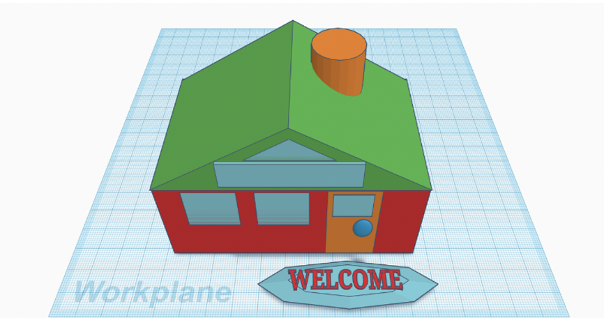

<title>Year 9 CS</title>

<table>
  <tr>
    <td style='text-align:center;'></td>
  </tr>
  </table>
## Year 4 Computing Unit: Design 

| Objectives:

+ To examine the differences and similarities between 2D and 3D shapes; you then created, selected, and moved 3D objects, which you looked at from different views.
+ To discuss the differences and similarities between working with 2D and 3D graphics, then combined, resized, and recoloured a number of 3D objects to create a real life 3D object.
+ To create a 3D model of a physical object by rotating and positioning a range of 3D objects.
+ To use 3D objects as placeholders to make holes in other 3D objects, in order to create a useful object.

| Learning outcomes:

+ To discuss the similarities and differences between 2D and 3D shapes.
+ To explain why we might represent 3D objects on a computer.
+ To select, move, and delete a digital 3D shape.
+ To identify how graphical objects can be modified.
+ To resize a 3D object.
+ To change the colour of a 3D object.
+ Torotate a 3D object.
+ To position 3D objects in relation to each other.
+ To select and duplicate multiple 3D objects. 
+ To identify the 3D shapes needed to create a model of a real-world object.
+ To create digital 3D objects of an appropriate size.
+ To group a digital 3D shape and a placeholder to create a hole in an object.

| Learning pathway:

In this introduction to TinkerCad children will make 3D objects such as houses, pencil holders and name labels. This unit of work will equip them for following units in following years when they start making more in-depth projects in TinkerCAD. Their last project is to develop a Tutankhamun mask which is an IT / IPC link, using all the skills they have learnt over the course of the unit.

<table>
  <tr>
    <td style='text-align:center;'></td>
  </tr>
  </table>
